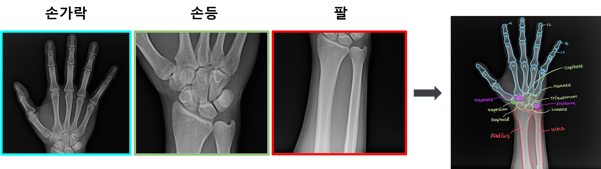
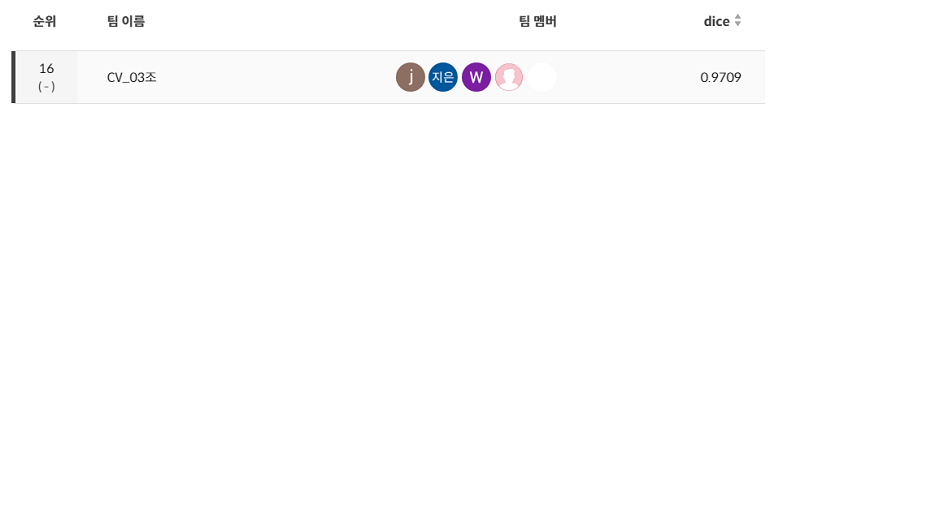
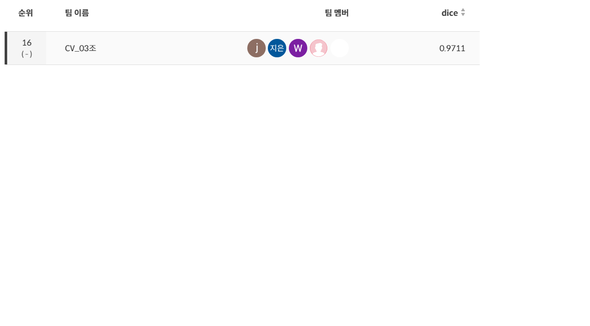

<p align="center">
    <picture>
        
    </picture>
    <div align="center">
        
        
    </div>
</p>

# ✨ 팀 소개

Thanks goes to these wonderful people ([emoji key](https://allcontributors.org/docs/en/emoji-key)):

<div align="center">
    <table>
    <tr>
        <td align="center"><a href="https://github.com/seungki1011"><br /><sub><b>김승기</b></sub><br />
        <a href="https://github.com/boostcampaitech5/level2_cv_semanticsegmentation-cv-03/commits?author=seungki1011" title="Code">💻</a>
        <a href="https://github.com/boostcampaitech5/level2_cv_semanticsegmentation-cv-03/tree/master/utils" title="Tools">🔧</a>
        <a href="https://github.com/boostcampaitech5/level2_cv_semanticsegmentation-cv-03" title="Maintenance">🚧</a>
        </td>
        <td align="center"><a href="https://github.com/jjjuuuun"><br /><sub><b>김준영</b></sub></a><br />
        <a href="https://github.com/boostcampaitech5/level2_cv_semanticsegmentation-cv-03/commits?author=jjjuuuun" title="Code">💻</a>
        <a href="https://github.com/boostcampaitech5/level2_cv_semanticsegmentation-cv-03#%EF%B8%8F-directory" title="Infrastructure">🚇</a>
        <a href="https://calico-dance-4bf.notion.site/MMSegmentation-71f191822d5042129ccbcf7b9384f211" title="Tutorial">✅</a>
        </td>
        <td align="center"><a href="https://github.com/helpmeIamnewbie"><br /><sub><b>전형우</b></sub></a><br />
        <a href="https://github.com/boostcampaitech5/level2_cv_semanticsegmentation-cv-03/issues/created_by/helpmeIamnewbie" title="Code">💻</a>
        <a href="https://github.com/boostcampaitech5/level2_cv_semanticsegmentation-cv-03" title="Tools">🔧</a>
        <a href="https://github.com/boostcampaitech5/level2_cv_semanticsegmentation-cv-03" title="Data">🔣</a>
        </td>
        <td align="center"><a href="https://github.com/CheonJiEun"><br /><sub><b>천지은</b></sub></a><br />
        <a href="https://github.com/boostcampaitech5/level2_cv_semanticsegmentation-cv-03/commits?author=CheonJiEun" title="Code">💻</a>
        <a href="https://github.com/boostcampaitech5/level2_cv_semanticsegmentation-cv-03" title="Data">🔣</a>
        <a href="https://github.com/boostcampaitech5/level2_cv_semanticsegmentation-cv-03" title="Ideas">🤔</a>
        </td>
        <td align="center"><a href="https://github.com/Eyecaramba"><br /><sub><b>신우진</b></sub></a><br />
        <a href="https://github.com/boostcampaitech5/level2_cv_semanticsegmentation-cv-03/commits?author=Eyecaramba" title="Code">💻</a>
        <a href="https://github.com/boostcampaitech5/level2_cv_semanticsegmentation-cv-03" title="Ideas">🤔</a>
        <a href="https://github.com/boostcampaitech5/level2_cv_semanticsegmentation-cv-03" title="Research">🔬</a>
    </td>
  </tr>
</table>
</div>

This project follows the [all-contributors](https://github.com/all-contributors/all-contributors) specification. Contributions of any kind welcome!

# 💀 프로젝트 소개

<p align="center">
    <picture>
        
    </picture>
</p>

뼈는 우리 몸의 구조와 기능에 중요한 영향을 미치기 때문에, 정확한 뼈 분할은 의료 진단 및 치료 계획을 개발하는 데 필수적입니다. Bone segmentation은 인공지능 분야에서 중요한 응용 분야 중 하나로, 특히, 딥러닝 기술을 이용한 뼈 segmentation은 많은 연구가 이루어지고 있으며, 다양한 목적으로 도움을 줄 수 있습니다.
1. 질병 진단의 목적으로 뼈의 형태나 위치가 변형되거나 부러지거나 골절 등이 있을 경우, 그 부위에서 발생하는 문제를 정확하게 파악하여 적절한 치료를 시행할 수 있습니다.
2. 수술 계획을 세우는데 도움이 됩니다. 의사들은 뼈 구조를 분석하여 어떤 종류의 수술이 필요한지, 어떤 종류의 재료가 사용될 수 있는지 등을 결정할 수 있습니다.
3. 의료장비 제작에 필요한 정보를 제공합니다. 예를 들어, 인공 관절이나 치아 임플란트를 제작할 때 뼈 구조를 분석하여 적절한 크기와 모양을 결정할 수 있습니다.
4. 의료 교육에서도 활용될 수 있습니다. 의사들은 병태 및 부상에 대한 이해를 높이고 수술 계획을 개발하는 데 필요한 기술을 연습할 수 있습니다.

이번 프로젝트는 `Boostcamp AI Tech` CV 트랙내에서 진행된 대회이며 mean dice coefficient으로 최종평가를 진행하게 됩니다.

# 📆 프로젝트 일정

프로젝트 전체 일정

- 2023.06.05 ~ 2023.06.22

프로젝트 세부 일정

- 2023.06.05 ~ 2023.06.09 : Semantic Semgmentation에 대해 알아보기
- 2023.06.08 ~ 2023.06.08 : Baseline Model 실험
- 2023.06.08 ~ 2023.06.09 : EDA
- 2023.06.09 ~ 2023.06.11 : Augmentation 실험
- 2023.06.12 ~ 2023.06.14 : Loss, Optimizer, Image size 실험
- 2023.06.14 ~ 2023.06.14 : MMSegmentation 구현
- 2023.06.14 ~ 2023.06.22 : Model, Image size, Offline Augmentation 실험
- 2023.06.21 ~ 2023.06.22 : Ensemble

# 👨‍💻 프로젝트 수행

1. [EDA](https://jjjuuuun.notion.site/EDA-db11b32576644efa9dc836a9135b55f0?pvs=4)✔️
2. [Augmentation](https://jjjuuuun.notion.site/Augmentation-5767f538c8ee4cf88462fe1bf2526a96?pvs=4)✔️
3. [Model](https://jjjuuuun.notion.site/Model-c8ddb0c1ddbf41abb5c0a2937da16b61?pvs=4)✔️
4. [중간정리](https://jjjuuuun.notion.site/09699a2814c04e83bb391627ab965c01?pvs=4)⭐
5. [발표자료](https://jjjuuuun.notion.site/f0407bed529a4bbbae93d5d6c520ec4f?pvs=4)⭐

# 🗒️ 프로젝트 결과

#### Public


#### Private


# 🔄️ Directory

```bash
├── .gitignore
├── TTA.py
├── dataset.py
├── inference.py
├── main.py
├── metric.py
├── test.py
├── train.py
├── pre-commit-config.yaml
├── gitcommit_template.txt
├── README.md
├── imgs
├── utils
└── mmsegmentation
    ├──  _teamconfigs_
    │    └── [test]ExpName
    │         ├── config.py
    │         ├── dataset.py
    │         ├── default_runtime.py
    │         ├── schedule.py
    │         └── segformer_mit-b0.py         
    │    └── [test]MMSeg_AMP_GA
    │
    ├── train.py
    └── test.py 
```

# ⚙️ 설치

####  Baseline Code
```pip install -r requirements.txt ```

#### MMSegmentation
Link ➡️ 
1. [MMSegmentation for our Project](https://jjjuuuun.notion.site/MMSegmentation-71f191822d5042129ccbcf7b9384f211?pvs=4)✔️
2. [Official GitHub](https://github.com/open-mmlab/mmsegmentation)😀

# ⚡️ 빠른 시작

#### Train
``` python train.py --exp-name {실험명} ```
#### Evaluation
``` python test.py --exp-name {실험명} ```

# 🤔 Wrap-Up Report

[Wrap-Up Report](https://github.com/boostcampaitech5/level2_cv_semanticsegmentation-cv-03/blob/master/Semantic%20Segmentation%20Wrap%20Up.pdf)⭐

